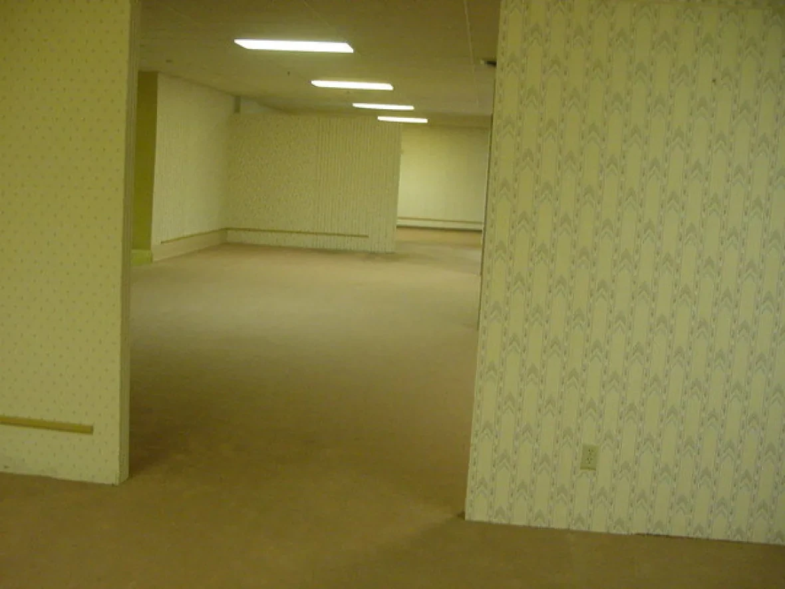

# 工程數學報告：四元數 vs 尤拉角
### ——無限後室青春版——

> **這不只是一份工程數學報告。**
> 這是一個隱藏在學術外殼下的第一人稱恐怖生存遊戲。

## 🎮 立即遊玩

**[▶ 點此進入後室](https://squl032.github.io/math-test/)**

---

## 專案簡介

本專案以「工程數學期末報告」為主題包裝，實際上是一款在無限程序生成迷宮（The Backrooms Level 0）中探索、躲避怪物、收集補給的第一人稱瀏覽器遊戲。

玩家在體驗遊戲的同時，可透過右上角即時數據面板與底部示波器，直觀理解**尤拉角（Euler Angles）** 與 **四元數（Quaternion）** 在 3D 旋轉描述上的差異，包括萬向鎖（Gimbal Lock）的實際發生情境。

---

## 功能特色

### 🗺️ 無限程序生成迷宮
- 以 chunk 為單位動態生成，理論上可無限延伸
- 每個通道保證 9 單位以上寬度，不會出現死路
- 使用 sin-hash 種子演算法確保相鄰 chunk 的牆壁銜接一致

### 👾 怪物追逐系統
- 一次只出現一隻怪物，消滅後隨機召喚下一隻（不重複）
- 使用 **A\* 尋路演算法** 繞過牆壁追蹤玩家
- 距離越遠，速度**指數成長**（最高 6 倍），真的追不到會直接瞬移
- 被擊中會受到正確方向的擊退效果

目前怪物陣容：
| 怪物 | 速度 | 特性 |
|------|------|------|
| Simion | ★★★ | 均衡型 |
| MJ | ★★★★ | 速度較快 |
| Obunga | ★★★☆ | 攻擊力高、攻擊冷卻短 |

### 🕷️ 天花板 / 地板爬行者
- 隨機附著在天花板或地板上，靜止守候
- 玩家靠近 9 單位內會發動定點攻擊（每 2.5 秒一次，造成少量傷害）
- 攻擊時有紅色光束特效
- 需要 **1～4 槍** 才能擊殺（隨機耐久）

### 🥛 杏仁水補給品
- 玩家受傷後才會開始在迷宮中生成杏仁水
- 走近自動撿起，回復 **30 HP**
- 最多同時存在 6 瓶，跑太遠的會消失讓新的在附近生成

### 📐 旋轉模式切換（核心學術內容）
- **尤拉角模式**：解除角度限制後，仰視超過 90° 會觸發萬向鎖，畫面旋轉將失控
- **四元數模式**：任何角度下旋轉皆穩定，不存在萬向鎖問題
- 右上角即時顯示 Roll / Pitch / Yaw 數值
- 底部示波器即時繪製三軸角度曲線

---

## 操作說明

| 操作 | 功能 |
|------|------|
| 滑鼠移動 | 轉動視角 |
| W A S D | 移動 |
| Q | 切換衝刺 開/關（永遠比怪物快） |
| SHIFT | 蹲下 |
| SPACE | 跳躍 |
| 左鍵點擊 | 射擊（無限子彈） |
| P | 重置座標與視角 |
| ESC | 暫停 / 開啟設定選單 |

### 設定選單（底部 Bar）
- **尤拉角 / 四元數**：切換旋轉演算法
- **角度限制開關**：開啟後俯仰角限制在 ±89.9°，關閉可觸發萬向鎖
- **怪物開關**：暫時關閉怪物
- **速度滑桿**：調整怪物基礎速度（玩家步行速度會自動同步）

---

## 技術架構

```
math-test/
├── index.html          # 主頁面殼層
├── style.css           # 所有樣式
├── js/
│   └── main.js         # 遊戲主程式（~1200 行）
├── mobs/
│   ├── registry.js     # 怪物資料庫（新增怪物只需在此加一筆）
│   ├── simion/
│   │   ├── avatar.png
│   │   └── chase.mp3
│   ├── MJ/
│   │   ├── MJ.png
│   │   └── MJ-chase.mp3
│   └── obunga/
│       ├── obunga.png
│       └── obunga-chase.mp3
└── bgm1.mp3            # 後室背景音樂
```

### 使用技術
- **Three.js r128** — 3D 場景渲染、Mesh、Sprite、Fog、材質貼圖
- **Chart.js** — 即時角度示波器
- **Pointer Lock API** — 第一人稱滑鼠捕捉
- **A\* 尋路** — 8 方向網格搜尋（CELL=4 單位、GRID_R=28 格）
- **程序生成迷宮** — chunk 化 sin-hash 種子演算法

---

## 新增怪物

只需在 `mobs/registry.js` 加一筆，並在 `mobs/<id>/` 放入圖片與音效：

```javascript
{
    id:              'yourMob',
    name:            '顯示名稱',
    image:           'mobs/yourMob/avatar.png',
    audio:           'mobs/yourMob/chase.mp3',
    hp:              100,
    speed:           0.11,
    attackDmg:       8,
    attackRange:     2.8,
    attackCooldown:  55,
    hitRadius:       2.5,
}
```

---

## 製作

工程數學期末報告 | Three.js + Vanilla JS | The Backrooms 主題
